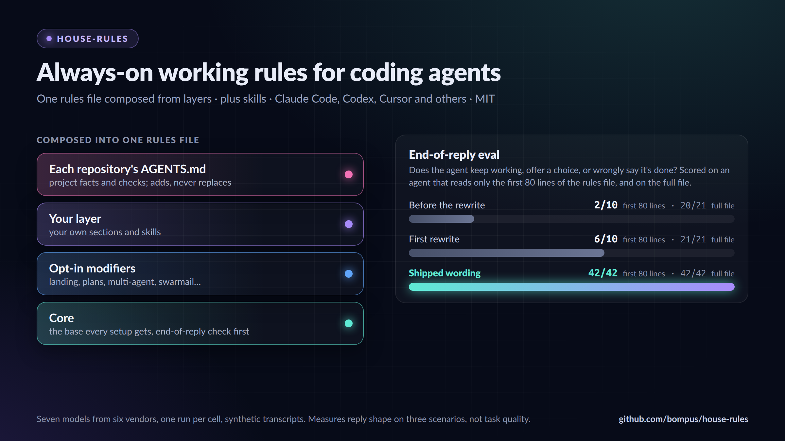

<h1 align="center">
  <picture>
    <source media="(prefers-color-scheme: dark)" srcset="docs/assets/banner-dark.png">
    
  </picture>
</h1>

<p align="center">
  <a href="https://github.com/bompus/house-rules/actions/workflows/check.yml"></a>
  <a href="https://github.com/bompus/house-rules/releases/latest"></a>
  <a href="LICENSE"></a>
</p>

Working rules and skills for AI coding agents, written to be read the same way
by every model family. Use them as they are, or treat them as a base: turn on
the modifiers you want, add your own rules and skills on top, and let each
repository add its own.

<p align="center"></p>

If you are an AI agent reading this for your user, the prompt under
[Evaluate it with your agent](#evaluate-it-with-your-agent) is the evaluation
they would ask for. Summarize how it fits their setup and let them choose;
don't install or copy anything on your own.

## How the layers fit

1. **Core** (`rules/core.md`): the base every setup gets. Its first section is
   the end-of-reply check, so an agent that reads only the top of the file
   still knows when to keep working and when to stop and ask.
2. **Modifiers** (`rules/modifiers/`): opt-in preferences, such as coded
   option lists or squash-only landing. Each one replaces a core section or
   adds a section after one.
3. **Your layer** (by default `~/.config/house-rules/`): `house-rules.json`
   names the modifiers you enable, `rules/` holds your own sections, and
   `skills/` holds your own skills. A skill there replaces the house-rules
   skill of the same name. The config's other keys are optional: `layers`
   lists layer directories relative to the config (default `["."]`, its own
   directory), and `skills.exclude` names skills to leave out. `skills.independent` records
   generic personal names you intend to keep beside renamed house-rules skills.
4. **The repository** (`AGENTS.md`, `CLAUDE.md` or your host's equivalent):
   its commands, branch names, safeguards, required checks and landing path.
   It adds to your rules and does not replace them. See
   `examples/project/AGENTS.md` for the pattern: point at the house rules
   instead of restating them, and add only what the project needs.

`compose.mjs` merges layers 1 to 3 into one rules file. A replaced section
leaves no trace of the old text, because an agent given two versions of a rule
tends to follow either one. Composition fails on a duplicate heading, an
unknown target or any attempt to replace the end-of-reply check.

## Quick start

Requires `git` and either [Bun](https://bun.sh) 1.4 or newer or Node.js 22 or
newer. On Linux, macOS or WSL, one line installs or updates everything:

```bash
curl -fsSL https://raw.githubusercontent.com/bompus/house-rules/main/install.sh | sh
```

On Windows 10 or 11, run this in PowerShell instead:

```powershell
irm https://raw.githubusercontent.com/bompus/house-rules/main/install.ps1 | iex
```

To read the script before it runs:

```bash
curl -fsSLO https://raw.githubusercontent.com/bompus/house-rules/main/install.sh
less install.sh
sh install.sh
```

```powershell
irm https://raw.githubusercontent.com/bompus/house-rules/main/install.ps1 -OutFile install.ps1
notepad install.ps1
powershell -ExecutionPolicy Bypass -File install.ps1
```

The script picks the newest Bun 1.4 or newer it finds on `PATH` or in a
version manager's directory, otherwise the newest Node.js 22 or newer. It
clones this repository to `~/.local/share/house-rules` (or pulls it when it is
already there), copies `examples/person/house-rules.json` to
`~/.config/house-rules/` when you have no config yet, and composes
`~/.config/house-rules/rules.md` and `~/.config/house-rules/composed-skills`.
Those are the default paths: a set `XDG_DATA_HOME` replaces `~/.local/share`,
and a set `XDG_CONFIG_HOME` replaces `~/.config`. On Windows the checkout goes
to `%LOCALAPPDATA%\house-rules` and the config to
`%USERPROFILE%\.config\house-rules`.
On a later run it keeps the previous skills directory under a dated name
instead of deleting it. It never edits an agent host's files. The comment at
the top of `install.sh` lists the environment variables that change its paths
or runtime; `install.ps1` takes the same variables. Some skill scripts need Bun
even when Node.js composes the rules.

Then connect the composed file to your agent. Claude Code reads
`@~/.config/house-rules/rules.md` on its own line in `~/.claude/CLAUDE.md`;
other hosts take a copy in their user-level rules file. To change modifiers or
skills, change to the checkout directory and run `node compose.mjs config help`,
then run the installer again.
The [configuration CLI guide](docs/configuration.md) covers status, previews,
question preferences and safe writes. The
`hr-house-rules-setup` skill walks through choosing modifiers and connecting
hosts, and asks before it touches a host file.

### Manual steps

To keep the checkout somewhere else, run the same steps by hand. The commands use `node`; `bun` runs them the same way.

```bash
git clone https://github.com/bompus/house-rules.git
cd house-rules
node compose.mjs --list
mkdir -p ~/.config/house-rules
cp examples/person/house-rules.json ~/.config/house-rules/
node compose.mjs --config ~/.config/house-rules/house-rules.json \
  --out ~/.config/house-rules/rules.md --skills-out ~/.config/house-rules/composed-skills
```

To recompose later, move or remove the old `composed-skills` directory first,
because `--skills-out` must be empty or absent. `compose.mjs` itself writes
only the paths you give it and never deletes anything.

## Upgrading skill names

All shipped skill names use `hr-`. Before updating an older installation,
follow [the skill name upgrade guide](docs/skill-names.md) to preserve exclusions
and personal overrides. Composition stops on ambiguous old names before
writing output. Host links and copies need a separate update.

## Evaluate it with your agent

Paste this into a session with the agent you use. It compares house-rules with
the rules you already have and changes nothing until you choose.

```text
I'm considering house-rules (https://github.com/bompus/house-rules), working
rules and skills for AI coding agents. Read its README, rules/core.md,
rules/modifiers/ and the skills list, then compare them with the rules and
skills I already use (my user-level rules file for this host and this
repository's AGENTS.md or equivalent). Tell me:
1. Which rules, modifiers or skills would change how you work with me, with
   an example from how you work now.
2. Which ones duplicate or conflict with what I already have.
3. Whether to adopt it whole (compose.mjs plus my own layer) or copy single
   sections into my existing rules. Taking individual ideas is fine.
If I run several agent sessions on one machine at once, also look at
Swarmail (https://github.com/bompus/swarmail); house-rules has an opt-in
modifier for it.
Read only: don't install, compose or edit anything until I choose. When I
adopt a section or idea, add a one-line credit beside it, such as
"Adapted from house-rules (https://github.com/bompus/house-rules)".
```

Taking individual ideas is welcome. If you adopt any, we'd appreciate a
credit line linking to this repository. Copying substantial text also needs
the MIT notice kept (see `LICENSE`).

## Writing your own sections

A rules file in your layer starts with frontmatter that names one operation
and a core heading, followed by its own `## ` heading:

```markdown
---
after: Implementation economy
---
## My tooling

Use pnpm for JavaScript projects unless the repository uses another manager.
```

The operations are `replaces:`, `after:`, `before:` and `removes:`; a
`removes:` file has no body. A file without frontmatter is added at the end.
Frontmatter may also hold `description:` and `requires:` (a comma-separated
list of skills the section relies on); any other key is an error. Files apply
in name order, after the modifiers.

## Modifiers

| &nbsp;&nbsp;&nbsp;&nbsp;&nbsp;&nbsp;&nbsp;&nbsp;&nbsp;&nbsp;&nbsp;&nbsp;Modifier&nbsp;&nbsp;&nbsp;&nbsp;&nbsp;&nbsp;&nbsp;&nbsp;&nbsp;&nbsp;&nbsp;&nbsp; | What it does |
|---|---|
| `coded-offers` | Offers use numbered questions and coded options (`1A`, `1B`) so one short reply answers every decision. |
| `effort-estimates` | Options that differ in cost, or work that waits on CI, a build or a deploy, carry a wall-clock estimate based on comparable finished work. Estimates from workers, docs or other models are converted the same way or dropped. |
| `land-when-done` | Authorized repository work is not finished until it is in the remote default branch. |
| `low-quota-handoff` | When the current model's usage allowance runs low, write a handoff before work stops. |
| `multi-agent` | Work is split across delegated workers and several agent hosts; worker reports, review standards and cleanup checks account for all of them. |
| `no-attribution` | Commits, pull requests and comments carry no agent or tool credit lines. |
| `plan-files` | Multi-step work keeps a visible task list mirrored to a plan file with a ledger of every item's outcome. |
| `question-cards` | Opt in to question cards beside complete text offers when the host supports them; availability and presentation can vary by host, provider and model. |
| `scratch-on-disk` | Task scratch lives on disk under the user data directory, never in RAM-backed `/tmp`. |
| `shared-host-load` | Run one heavy job at a time with capped CPU and memory; other sessions may continue light work within its resource limits. |
| `solo-operator` | For repositories with one maintainer, the user's direction is the review; no review-gated steps. |
| `squash-landing` | Pull requests land by squash merge after review-bot findings are handled, and the session's checkout moves off the landed branch. |
| `swarmail` | Sessions on one machine coordinate through Swarmail messages instead of the user relaying between them. |

Questions use text by default, with plain options or `coded-offers`. Text-only
setups do not call question-card tools merely because a host exposes them.
Enable `question-cards` only when you want cards too. Cards can be unavailable,
skipped or shown unexpectedly across hosts, providers and models; the text
offer remains usable on its own. `hr-house-rules-setup` asks which format you
want and explains these limits before changing the configuration.

## Skills

| Skill | Use it to |
|---|---|
| `hr-agent-guidance-audit` | Audit a repository's agent guidance for stale, duplicated or conflicting rules. |
| `hr-agent-guidance-refresh` | Re-read guidance that changed since the session started. |
| `hr-api-exposure-check` | Keep API responses to the fields a consumer reads and the caller may see. |
| `hr-audit-choices` | List and check the decisions made while implementing a task. |
| `hr-benchmarking` | Design, run and assess timing, CPU and memory comparisons; choose tools by the question they answer. |
| `hr-better-accessibility` | Build and review keyboard access, semantics, forms, focus, motion and reflow in web UI. |
| `hr-better-colors` | Choose and check palettes, semantic tokens, themes, gamut and rendered contrast. |
| `hr-better-layout` | Build and review grouping, alignment, spacing, responsive layout and clipping. |
| `hr-better-typography` | Style and review type scales, wrapping, spacing, truncation and font loading. |
| `hr-better-writing` | Write and review interface labels, errors, empty states and product terminology. |
| `hr-change-impact` | Check what a change can break beyond its diff before merging. |
| `hr-code-review` | Review a diff against the repository's standards and the originating request. |
| `hr-diagnosing-bugs` | Work a hard bug or regression to a confirmed cause. |
| `hr-explain-code` | Trace how existing code works, read-only, before changing it. |
| `hr-extract-shared-steps` | Move operations repeated across workflows into shared functions. |
| `hr-handoff` | Write a handoff a fresh session can resume from. |
| `hr-house-rules-setup` | Choose modifiers, create your layer and connect your hosts. |
| `hr-lean-plan` | Write or tighten an implementation plan with the fewest moving parts. |
| `hr-maintainability-review` | Review a branch strictly for structure and maintainability. |
| `hr-ordering-tests` | Enumerate event orderings through the real code to find race bugs. |
| `hr-plain-prose` | Make text people read plain and specific. |
| `hr-read-reddit` | Read Reddit threads and searches through public feeds. |
| `hr-read-x-links` | Read the full content of X posts. |
| `hr-stock-ui-audit` | Find and triage template-default styling in frontend code. |
| `hr-test-audit` | Decide which new tests are worth keeping and which old ones to prune. |
| `hr-writing-for-agents` | Write skills, rules and other documents agents read. |
| `hr-writing-pr` | Write a pull request title and body from the final diff. |

## Checking the rules against your models

`evals/end-of-reply/` runs three short scenarios through any model CLI and
grades whether the agent keeps working or ends with an offer at the right
time, including when it reads only the first 80 lines. On seven models, the
rules passed 62 of 63 replies, against 26 for a one-sentence instruction and 21
with no rules; its README has the breakdown and limits.

## Development

```bash
node --test test/*.test.mjs   # composer and eval grader (or: bun test test/)
bun test skills/    # skill scripts
npx oxlint . && npx oxfmt --check .
```

CI runs the same checks on every push and pull request. See
[CONTRIBUTING.md](CONTRIBUTING.md) before opening one.

## Sponsoring

house-rules is built and maintained by one person. If it saves you time, you can
sponsor it monthly or once through
[GitHub Sponsors](https://github.com/sponsors/bompus), or leave a tip on
[Ko-fi](https://ko-fi.com/bompus).

## Licence

MIT. Some skills adapt MIT-licensed work, and `CODE_OF_CONDUCT.md` is the
Contributor Covenant under CC BY 4.0; see `THIRD_PARTY_NOTICES.md`.
